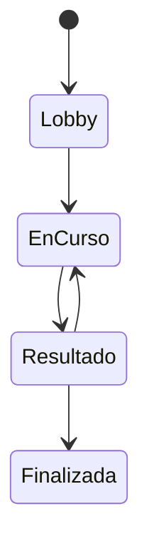

# TRIVIA_PRD.md

> Product Requirements Document – Multiplayer Trivia MVP

## 1. Objetivo

Construir una aplicación web estilo Kahoot para partidas en tiempo real administradas por un Host.

### Características principales

- Host crea una trivia.
- Define configuración y preguntas.
- Se genera un QR para unirse.
- Hasta 30–50 jugadores.
- Sin login.
- WebSockets para tiempo real.
- React + Vite + TypeScript.
- Node.js + Express + Socket.IO.
- Estado en memoria (sin persistencia).

## Flujo

1. Host configura la partida.
2. Agrega preguntas (formulario editable).
3. Se crea sesión + QR.
4. Jugadores ingresan nombre.
5. Lobby.
6. Inicio automático.
7. Cada pregunta:
   - Lectura (5 s por defecto)
   - Respuesta (20 s por defecto)
   - Resultado (5 s por defecto)
8. Si todos responden antes, termina la ronda.
9. Ranking en vivo (podio + puestos 4–10).
10. Podio final + estadísticas.

## Reglas

- Nombres únicos.
- Una conexión por dispositivo.
- Reconexión mediante UUID almacenado en localStorage.
- Solo la primera respuesta cuenta.
- Una única respuesta correcta.
- Siempre 4 opciones.
- Las respuestas se randomizan por defecto.
- Las preguntas pueden randomizarse opcionalmente.
- Preguntas pueden incluir imagen.
- Respuestas solo texto.
- Sin audio/video.

## Puntaje

Puntaje máximo configurable (ej. 1000).

Fórmula sugerida:

```
score = maxScore * (tiempoRestante / tiempoRespuesta)
```

Incorrecta = 0.

Sin penalización.

## Arquitectura

Frontend:
- React
- TypeScript
- Tailwind

Backend:
- Express
- Socket.IO

Estado:
- Session
- Player
- Question
- Round

Servidor como única fuente de verdad.

## Eventos Socket.IO

Host:
- host:createSession
- host:startGame

Jugador:
- player:join
- player:answer
- player:reconnect

Servidor:
- lobby:update
- round:start
- answers:reveal
- scoreboard:update
- game:finished

## REST

POST /session
GET /session/:id

## Estructura

```
client/
server/
shared/
```

## Casos de uso

- Crear trivia
- Editar preguntas
- Unirse mediante QR
- Responder
- Reconectarse
- Ver ranking
- Ver podio

## Wireframe Host

```
Configuración

Preguntas

[ Crear partida ]

Lobby
QR
Jugadores
[ Iniciar ]
```

## Wireframe Jugador

```
Nombre

Pregunta

A
B
C
D

Tiempo restante
Puntaje
```

## Wireframe Resultado

```
Respuesta correcta

Distribución:
A 10%
B 65%
C 15%
D 10%
```

## Estados



## Historias de usuario (extracto)

- Como Host quiero crear una trivia.
- Como jugador quiero unirme escaneando un QR.
- Como jugador quiero reconectarme sin perder mi progreso.
- Como Host quiero ver el ranking en tiempo real.

## Criterios de aceptación

- Latencia baja.
- Compatible con Chrome móvil y escritorio.
- 30 jugadores simultáneos.
- Sin pérdida de sincronización.
