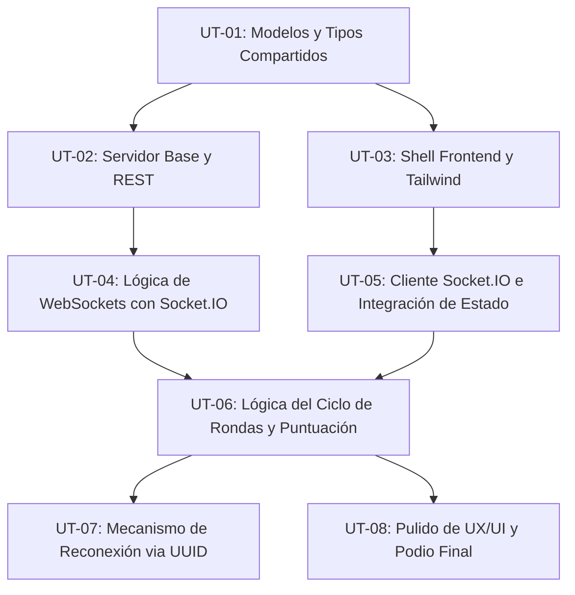

# TRIVIA_SRS.md – Especificación de Requerimientos de Software

Este documento detalla la especificación de requerimientos para el MVP de Trivia Multijugador en tiempo real. Define los requerimientos funcionales, las unidades de trabajo con sus dependencias y los casos de uso para estructurar las pruebas.

---

## 1. Especificación de Requerimientos Funcionales (RF)

### 1.1 Módulo del Host (Gestión de Partida)
- **RF-101: Configuración de la Trivia:** El Host debe poder definir el puntaje máximo por pregunta (ej. 1000 puntos) y los tiempos por defecto para cada fase de la pregunta (Lectura: 5s, Respuesta: 20s, Mostrar Resultados: 5s).
- **RF-102: Gestión de Preguntas:** El Host debe poder agregar, editar y eliminar preguntas mediante un formulario interactivo. Cada pregunta debe contener:
  - Texto de la pregunta.
  - Una imagen opcional (URL o archivo local).
  - Exactamente 4 opciones de respuesta (solo texto).
  - Indicación de cuál de las 4 es la respuesta correcta (única correcta).
- **RF-103: Inicialización de Sesión:** Al crear la partida, el servidor debe generar un ID único de sesión y un código QR para que los jugadores se unan.
- **RF-104: Control del Lobby:** El Host debe ver en tiempo real a los jugadores que se conectan y poder iniciar la partida manualmente.
- **RF-105: Visualización de Ranking y Podio:**
  - Entre rondas, el Host muestra la pantalla de resultados con la distribución de respuestas y el ranking en vivo (podio temporal + puestos del 4 al 10).
  - Al finalizar todas las preguntas, el Host muestra el podio final y estadísticas globales de la partida.

### 1.2 Módulo del Jugador (Participación)
- **RF-201: Registro en Lobby (Sin Login):** El jugador ingresa a la sesión usando el ID de sesión (o escaneando el QR) e ingresando un nombre/pseudónimo.
  - El nombre debe ser único dentro de la sesión.
- **RF-202: Interfaz Dinámica de Juego:** El jugador visualiza las 4 opciones de respuesta (A, B, C, D) en botones grandes y el tiempo restante de respuesta.
- **RF-203: Envío de Respuesta:** El jugador puede enviar su respuesta seleccionando una de las opciones.
  - Solo se registra la primera respuesta enviada.
- **RF-204: Reconexión:** Si el jugador se desconecta, la aplicación debe reconectarlo automáticamente usando un UUID almacenado en `localStorage`, manteniendo su puntaje y estado en la partida actual.

### 1.3 Módulo del Servidor (Lógica de Negocio y Tiempo Real)
- **RF-301: Gestión de Estado en Memoria:** El servidor mantendrá todo el estado en memoria activa (sesiones, jugadores, rondas, puntajes) sin persistencia en base de datos.
- **RF-302: Ciclo de Ronda Automático:** Cada ronda debe transicionar automáticamente por los siguientes estados:
  1. **Lectura (5s):** Se presenta la pregunta pero no se permite responder aún.
  2. **Respuesta (20s):** Se habilitan las opciones en los clientes de los jugadores. Si todos responden antes del límite, se finaliza la ronda de inmediato.
  3. **Resultado (5s):** Se revela la respuesta correcta y la distribución de respuestas en la pantalla del Host.
- **RF-303: Algoritmo de Puntuación:** El puntaje otorgado a un jugador por respuesta correcta se calcula según el tiempo de respuesta:
  $$score = maxScore \times \left(\frac{tiempoRestante}{tiempoRespuesta}\right)$$
  - Si la respuesta es incorrecta o no responde, el puntaje es 0.
- **RF-304: Mezcla Aleatoria (Randomización):**
  - Las opciones de respuesta se deben mezclar aleatoriamente para cada jugador de forma predeterminada.
  - Las preguntas se pueden mezclar aleatoriamente si el Host activa la opción de configuración correspondiente.

---

## 2. Unidades de Trabajo (WBS) y Dependencias

A continuación se desglosan las unidades de trabajo necesarias para el MVP, ordenadas por su orden de ejecución recomendado según sus dependencias.

### Detalle de Unidades de Trabajo

1. **UT-01: Modelos y Tipos Compartidos (shared/)**
   - **Descripción:** Definición de interfaces TypeScript para `Session`, `Player`, `Question`, `Round` y contratos de eventos WebSocket que usarán tanto el cliente como el servidor.
   - **Dependencias:** Ninguna.
   
2. **UT-02: Servidor Base y REST (server/)**
   - **Descripción:** Inicialización del servidor Express en Node.js con TypeScript. Implementación de los endpoints `POST /session` y `GET /session/:id`.
   - **Dependencias:** UT-01.

3. **UT-03: Shell Frontend y Configuración de Tailwind (client/)**
   - **Descripción:** Configuración de React con Vite y Tailwind CSS. Creación de la estructura de vistas (Lobby, Pantalla de Host, Pantalla de Jugador).
   - **Dependencias:** UT-01.

4. **UT-04: Lógica de WebSockets en Servidor (server/)**
   - **Descripción:** Configuración de Socket.IO en el backend. Manejo de conexiones de Host (`host:createSession`, `host:startGame`) y Jugadores (`player:join`). Emitir eventos de actualización de lobby (`lobby:update`).
   - **Dependencias:** UT-02.

5. **UT-05: Cliente de WebSockets e Integración (client/)**
   - **Descripción:** Conexión del cliente React a Socket.IO. Sincronización del estado del lobby e interfaz del jugador para mostrar la lista de participantes en tiempo real.
   - **Dependencias:** UT-03, UT-04.

6. **UT-06: Ciclo de Rondas, Temporizadores y Puntuación (server/ y client/)**
   - **Descripción:** Lógica de transiciones de estados de ronda en el servidor (Lectura $\rightarrow$ Respuesta $\rightarrow$ Resultado). Cálculo dinámico del score. Manejo de terminación temprana de la ronda si todos responden.
   - **Dependencias:** UT-04, UT-05.

7. **UT-07: Mecanismo de Reconexión (server/ y client/)**
   - **Descripción:** Implementación del UUID en `localStorage` del cliente. Lógica en el servidor para reasociar un socket nuevo a un jugador existente sin perder su puntaje ni su estado en la partida actual.
   - **Dependencias:** UT-06.

8. **UT-08: Pulido UX/UI, Podio y Estadísticas (client/)**
   - **Descripción:** Implementación de pantallas finales del podio, gráficos sencillos de distribución de respuestas por pregunta y animaciones de transición premium.
   - **Dependencias:** UT-06.

---

## 3. Casos de Uso (CU) y Especificación de Tests

Para garantizar la calidad de la implementación, definimos los casos de uso críticos mapeados a pruebas unitarias y de integración/E2E.

### CU-01: Creación de Trivia y Sesión por el Host
* **Flujo Principal:**
  1. El Host ingresa las configuraciones de la partida y una lista de preguntas.
  2. El Host hace clic en "Crear Partida".
  3. El servidor recibe los datos, genera una sesión en memoria con un ID y devuelve el QR de acceso.
* **Especificación de Pruebas (Test Cases):**
  - **TC-101 (Unitario - API REST):** Verificar que `POST /session` valide correctamente la estructura de las preguntas (debe tener exactamente 4 opciones, 1 correcta).
  - **TC-102 (Integración - Host):** Comprobar que al crearse la sesión, el host reciba un evento de éxito con un ID de sesión válido y la sesión se almacene en memoria del servidor.

### CU-02: Jugador se une al Lobby
* **Flujo Principal:**
  1. El jugador ingresa a la URL de la sesión.
  2. El jugador escribe su nombre y hace clic en "Unirse".
  3. El servidor valida el nombre, añade al jugador y notifica a todos los clientes del lobby.
* **Especificación de Pruebas (Test Cases):**
  - **TC-201 (Unitario - Backend):** Validar que no se permita el ingreso de un jugador con un nombre duplicado en la misma sesión.
  - **TC-202 (Integración - WebSockets):** Verificar que todos los sockets de la sesión reciban el evento `lobby:update` con la lista de jugadores actualizada al unirse un nuevo participante.

### CU-03: Responder Pregunta y Cálculo de Puntaje
* **Flujo Principal:**
  1. Se inicia la fase de respuesta para una pregunta (20s).
  2. Un jugador responde correctamente a los 10 segundos (de un total de 20s disponibles) con un puntaje máximo configurable de 1000.
  3. El servidor recibe la respuesta, aplica la fórmula y asigna el puntaje correspondiente.
* **Especificación de Pruebas (Test Cases):**
  - **TC-301 (Unitario - Algoritmo):** Validar que para un tiempo restante del 50% ($10s/20s$) y maxScore de 1000, el puntaje calculado sea exactamente 500.
  - **TC-302 (Unitario - Backend):** Validar que solo se compute la primera respuesta enviada por un jugador para esa pregunta; envíos subsiguientes deben ser ignorados.
  - **TC-303 (Integración - Fin de Ronda):** Comprobar que si el 100% de los jugadores responden antes de que expire el temporizador de respuesta, se finalice la fase inmediatamente y se transicione a la fase de resultado.

### CU-04: Reconexión de un Jugador Desconectado
* **Flujo Principal:**
  1. El jugador se desconecta abruptamente en mitad de una partida.
  2. El socket se cierra en el servidor, pero el jugador no es eliminado inmediatamente de la sesión.
  3. El cliente del jugador detecta la desconexión e intenta reconectarse usando el UUID almacenado en `localStorage`.
  4. El servidor vincula el nuevo socket al jugador existente y le envía el estado actual del juego.
* **Especificación de Pruebas (Test Cases):**
  - **TC-401 (Integración - Reconexión):** Simular una desconexión y verificar que al enviar `player:reconnect` con el UUID correcto, el servidor mantenga el puntaje anterior del jugador y actualice el ID del socket activo.
